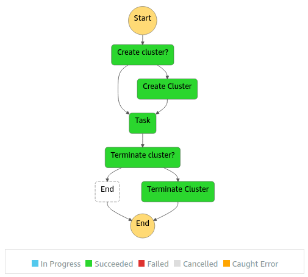

# EMR with Step Functions task for running SparkPi example

## Introduction

This IaC builds the following state machine:




## Execution

Example Step Functions input if the cluster is non-existent:

```json
{
    "CreateCluster": true,
    "TerminateCluster": true,
    "ClusterName": "wojtek-emr-sfn-sparkpi-poc"
}
```

If the cluster is already running, provide the following input:

```json
{
    "CreateCluster": false,
    "CreateClusterResult": {
        "ClusterId": "<EMR_CLUSTER_ID>"
    }
    "TerminateCluster": true
}
```

## Deployment

To deploy this stack to your account:
 - edit `bin/emr-step-functions-spark-pi.ts` file and provide your user's ARN and email addresses for alert recipients
 - build and test the package: `npm run build && npm test`
 - deploy the package: `npx cdk deploy EmrStepFunctionsSparkPiStack`
