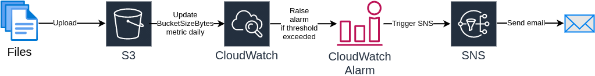

# S3 bucket with size alarm

This repository contains CDK infrastructure, which creates:
 - an S3 bucket with a random name (prefixed with `s3-bucket-with-size`)
 - an IAM policy which gives read/write access to the bucket to AWS user (see `userArn` in `bin/infrastructure.ts`)
 - a CloudWatch metric for `BucketSizeBytes`
 - a CloudWatch alarm
 - a SNS topic for alarm messages
 - a SNS e-mail subscription for predefined emails (see `alertRecipients` in `bin/infrastructure.ts`)

The resulting pipeline is presented below:

# Rationale

The simplest way to monitor the bucket size is the default `BucketSizeBytes` metric.

It is updated by AWS once every day which *makes it hard to test*.

What's even worse, the availability of the metric's value can be delayed more than 24 hours, which makes it possible for the CloudWatch alarm to be constantly in `Insufficient Data` state, because the maximum alarm period is 24 hours. Thus, it is critical to set the `evaluationPeriods` to a value larger than 1, and pick the maximum statistic out of the available values.

Moreover, as of August 2021, AWS CDK *does not support importing S3 metrics in CDK code*, although it [supports importing other metrics](https://docs.aws.amazon.com/cdk/latest/guide/how_to_set_cw_alarm.html). It is also discussed in this [issue](https://github.com/aws/aws-cdk/issues/1739).

Instead, a new metric has to be created with properly set values for `namespace`, `metricName` and `dimensions`, which is burdensome.

# Deployment

To deploy this stack to your account:
 - edit `bin/infrastructure.ts` file and provide your user's ARN and email addresses for alert recipients
 - build and test the package: `npm run build && npm test`
 - deploy the package: `npx cdk deploy s3-bucket-with-size-alert`
